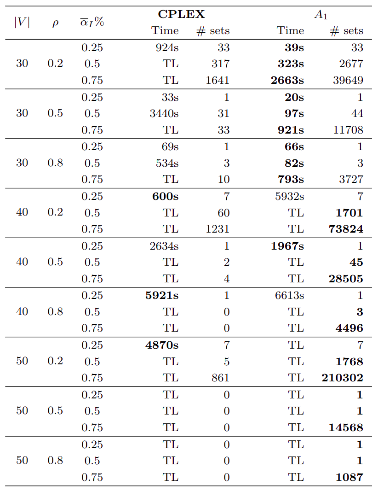
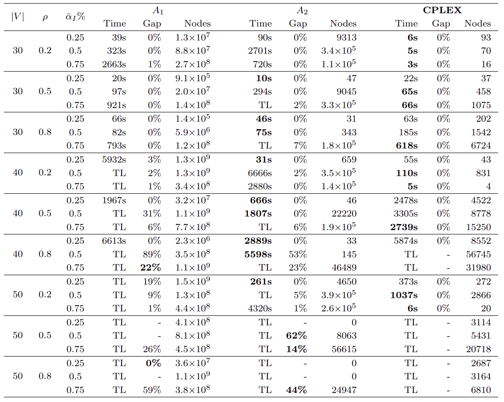
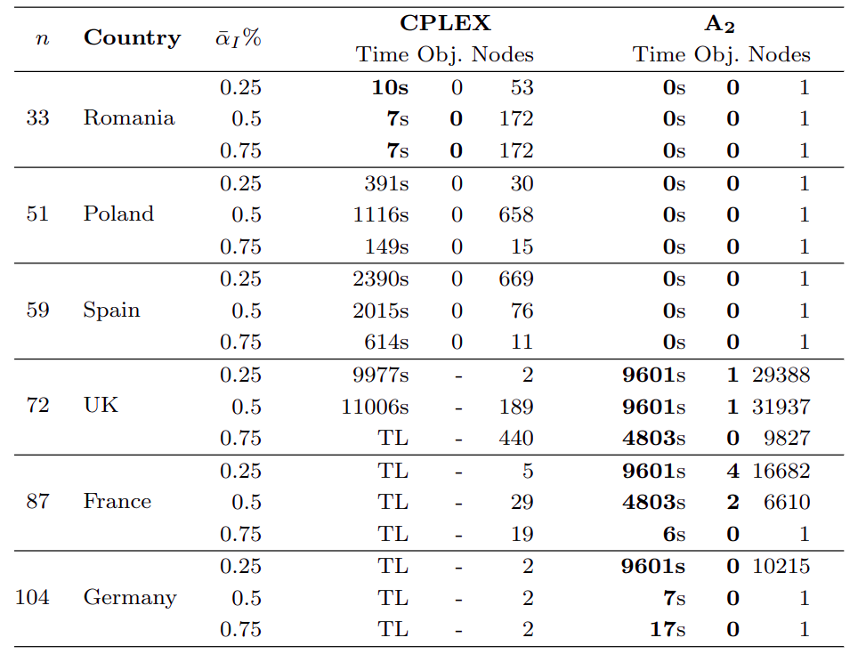

[](https://pubsonline.informs.org/journal/ijoc)

# Correlation Clustering under Mediation

This archive is distributed in association with the [INFORMS Journal on
Computing](https://pubsonline.informs.org/journal/ijoc) under the [MIT License](LICENSE).

The software and data in this repository are a snapshot of the software and data
that were used in the research reported on in the paper 
[Correlation Clustering under Mediation](https://doi.org/10.1287/ijoc.2023.YYYY) by Z. Ales, C. Engelbeen, R. Figueiredo.

## Cite

To cite the contents of this repository, please cite both the paper and this repo, using their respective DOIs.

(https://doi.org/10.1287/ijoc.2022.0129)

(https://doi.org/10.1287/ijoc.2022.0129.cd)

Below is the BibTex for citing this snapshot of the respoitory.

```
@article{ales2023correlation,
  author =        {Ales, Z. and Engelbeen, C. and Figueiredo, R.},
  publisher =     {INFORMS Journal on Computing},
  title =         {{Correlation Clustering Problem under Mediation}},
  year =          {2023},
  doi =           {10.1287/ijoc.2019.0000.cd}
}  
```

## Description

The goal of this software is to solve the correlation clustering problem under mediation with the methods presented in the article.

## Building

The execution of the software requires the installation of CPLEX, Julia and of the following Julia packages: DataStructures, JuMP, CPLEX, and Dates.
To test if everything is installed you can solve only one instance with a maximal time of 20 seconds by using the following commands in a Julia console:

```
cd("src")
include("expe.jl")
testExperiment()
```

## Results

Table 2 in the article shows the mean time and the number of maximal mediator sets generated for Algorithm A1 and CPLEX on random instances.



Table 3 presents the mean time, the mean gap and the mean number of nodes of the enumeration trees for Algorithm A1, A2 and CPLEX on random instances.



Table 4 presents similar results for Algorithm A1 and CPLEX over instances from the European parliament.




## Replicating

To replicate the results, do the following in a Julia console
```
cd("src")
include("expe.jl")
articleExperiment()
```

The results obtained will be stored in folder `results/size30to50` for the random instances and in folder `results/parliament` for the instances from the parliament. In both the result files and the code, Algorithm 1 is denoted by `BT2Unified`, Algorithm 2 by `BT2PartialRelaxationUnified`, and the version of CPLEX that generates all the maximal mediator sets by `CPLEXAllMediatorSets`.
